# Agenda Eletrônica
<h2>Imagens do projeto</h2>

<h3>Menu de opções do programa</h3>

Quando iniciar o projeto, o usuário terá que selecionar a opção da funcionalidade que deseja, digitando
números  entre [1, 2, 3, 4, 5 ou 9].

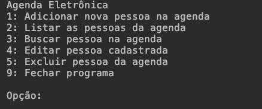

<h3>Adicionar nova pessoa</h3>

Para adicionar uma nova pessoa, basta inserir o nome e depois o telefone. Caso queira adicionar mais 
telefones, digite "s" quando aparecer na tela "Outro telefone? (s/n): ", caso contrário, digite "n".

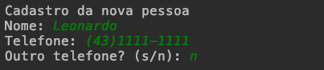

<h3>Listar Agenda</h3>
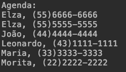

<h3>Buscar Pessoas</h3>

O usuário não vai precisar digitar o nome da pessoa por inteiro, basta  digitar uma única letra do nome, que o programa vai retornar todas as pessoas que tenham essa letra em seu nome.

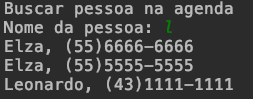

<h3>Editar Pessoa</h3>

Para editar, o usuário tem que digitar o nome da pessoa. Não precisa obrigatoriamente digitar o nome desta pessoa por inteiro, basta informa uma única letra que o programa vai fazer a busca por essa pessoa. 
Após isso, o usuário deverá digitar o índice da linha que a pessoa está na agenda para o programa selecionar
esta pessoa.

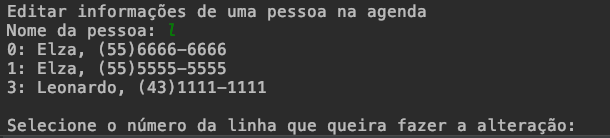

Depois que o usuário informou a linha, será exibido um menu. O usuário terá 3 opções: Atualizar nome, 
Atualizar telefone ou Voltar (que seria para cancelar a edição desta pessoa). Então, basta o usuário digitar
número entre [1, 2, 3].

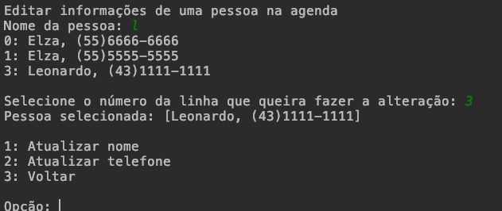

<h3>Deletar Pessoas</h3>

O usuário deve informar o nome da pessoa. Não precisa obrigatoriamente informar o nome inteiro, basta
uma letra. O programa retornará os nomes das pessoas, dependendo da entrada do usuário. Caso não encontre
nenhum nome, o programa retornará uma mensagem dizendo que não foi possível encontrar a pessoa com
essas letras.

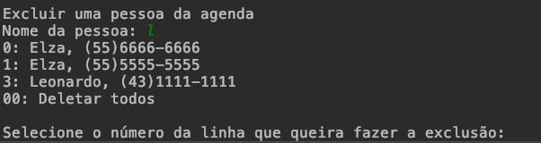

Depois, caso o programa retornar os nomes das pessoas, o usuário deverá digitar o índice da linha da pessoa que queira excluir.
Caso quiser excluir todos as pessoas que foram retornadas, basta digitar a opção "00". Se o usuário escolheu em excluir uma pessoa
específica, o programa pedirá a entrada do usuário novamente, para confirmar a exclusão da pessoa. A entrada do usuário vai ser "s"
que significa que pode confirmar a exclusão ou "n" que significa que vai cancelar a exclusão. Se o usuário escolheu para excluir todas
as pessoas retornadas, o programa também vai pedir a entrada do usuário, para confirmar se realmente quer excluir todos os nomes da
agenda.

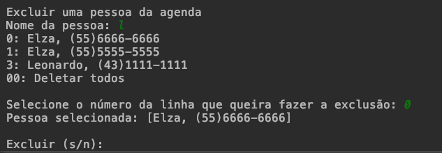

<h2>Diagrama de Caso de Uso</h2>
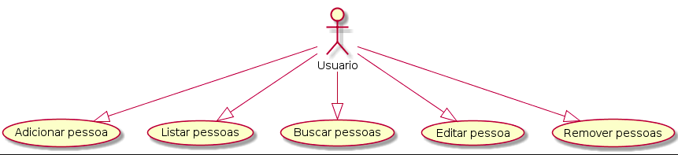

<h2>Diagrama de Sequência</h2>
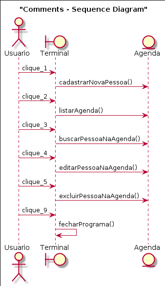

<h2>Diagrama de Classe</h2>
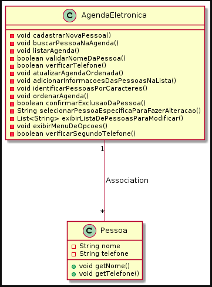

